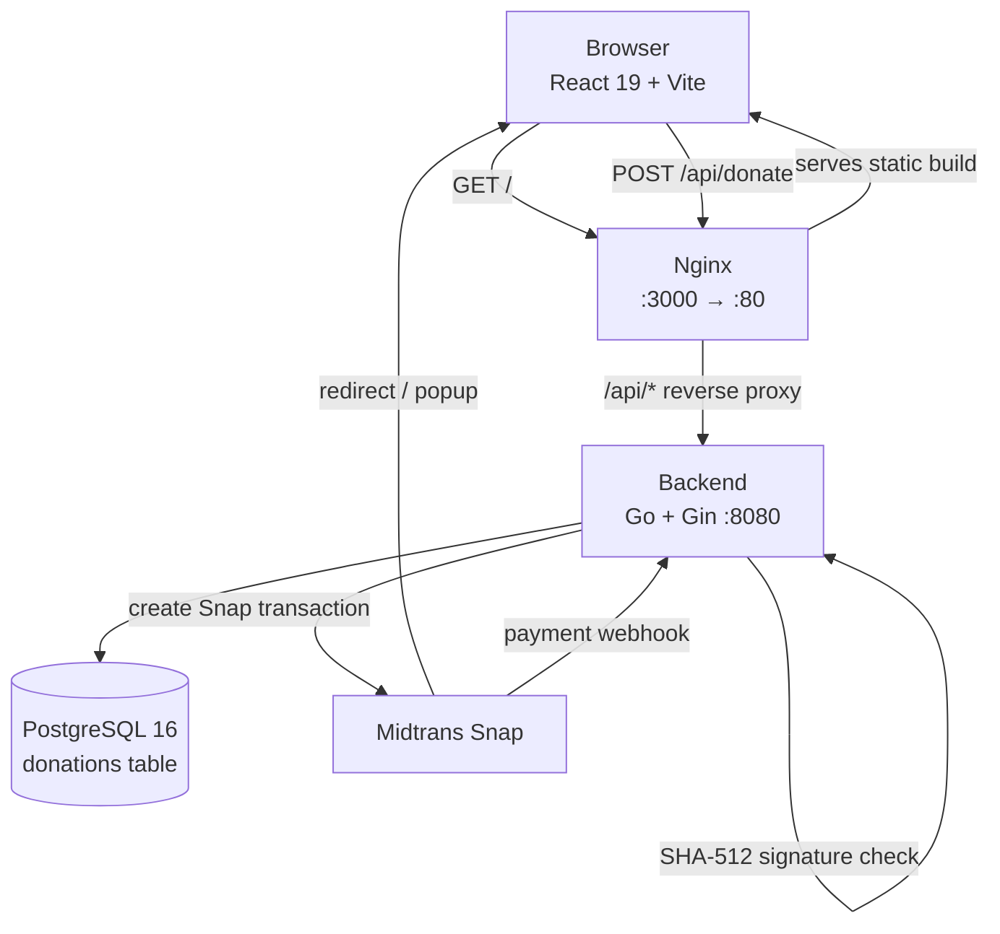

# Traktir Kopi ☕

A full-stack **payment gateway integration** with Midtrans — a complete,
open-source reference for accepting online payments securely. "Traktir saya kopi"
(buy me a coffee) is the demo use case: a Go backend, a React frontend, and
PostgreSQL, with server-side SHA-512 verification of every Midtrans webhook so
only genuine payments are confirmed.

---

## ✨ Features

- **End-to-end payment gateway** — full Midtrans Snap flow: create transaction →
  popup → verified webhook → confirmation.
- **Server-side verification** — every webhook is re-verified with SHA-512 against
  your server key, so only Midtrans can mark a donation as `PAID`.
- **Public donation wall** — completed (`PAID`) donations are listed publicly.
- **Dockerized** — the entire stack (Postgres + API + web) runs with one command.
- **No vendor lock-in** — plain Go/Gin, React/Vite, and PostgreSQL.

## 🧰 Tech Stack

| Layer     | Technology                                                        |
| --------- | ----------------------------------------------------------------- |
| Backend   | Go · [Gin](https://github.com/gin-gonic/gin) · GORM · Midtrans Go |
| Frontend  | React 19 · Vite · React Router · Tailwind CSS 4                   |
| Database  | PostgreSQL 16                                                     |
| Payments  | Midtrans Snap + SHA-512 webhook verification                      |
| Infra     | Docker Compose · Nginx (reverse proxy)                            |

## 🏗 Architecture



## 📁 Project Structure

```
traktir-kopi/
├── backend/
│   ├── cmd/api/            # entrypoint & routes
│   ├── internal/
│   │   ├── config/         # DB connection & auto-migration
│   │   ├── handlers/       # HTTP handlers (donations, webhook)
│   │   ├── models/         # GORM models
│   │   └── services/       # Midtrans payment service
│   ├── dockerfile
│   ├── go.mod
│   └── go.sum
├── frontend/
│   ├── src/
│   │   ├── pages/          # Home, Donate
│   │   ├── components/     # Navbar, Footer
│   │   └── lib/            # axios client
│   ├── dockerfile
│   ├── nginx.conf          # static serving + /api proxy
│   └── package.json
├── docker-compose.yml
└── .env                    # NOT committed — see below
```

## 🔑 Environment Variables

Secrets are read from environment variables — **never hardcoded**. Create a `.env`
file at the project root:

```bash
# .env
DB_PASSWORD=change-me
MIDTRANS_SERVER_KEY=SB-Mid-server-xxxx
VITE_MIDTRANS_CLIENT_KEY=SB-Mid-client-xxxx
```

| Variable                   | Used by  | Description                                       |
| -------------------------- | -------- | ------------------------------------------------- |
| `DB_PASSWORD`              | Postgres & backend | Database password                     |
| `MIDTRANS_SERVER_KEY`      | Backend  | Midtrans **server** key (secret)                  |
| `VITE_MIDTRANS_CLIENT_KEY` | Frontend | Midtrans **client** key (public, in browser)      |

> `docker-compose.yml` also sets `DB_HOST`, `DB_PORT`, `DB_USER`, and `DB_NAME`
> to sensible defaults, so you normally only need the three above.

## 🚀 Getting Started

### Prerequisites

- [Docker](https://docs.docker.com/get-docker/) and Docker Compose
- A [Midtrans](https://midtrans.com) account (sandbox is fine to start)

### Run the full stack (recommended)

```bash
# 1. Clone and enter the repo
git clone https://github.com/yourname/traktir-kopi.git
cd traktir-kopi

# 2. Create your .env (see above)
cp .env.example .env   # or create manually

# 3. Build & run everything
docker compose up --build
```

The web app is then available at <http://localhost:3000>.

### Run without Docker (development)

**Backend**

```bash
cd backend
export DB_HOST=localhost
export DB_PORT=5432
export DB_USER=postgres
export DB_PASSWORD=change-me
export DB_NAME=traktirkopi
export MIDTRANS_SERVER_KEY=SB-Mid-server-xxxx
export PORT=8080
go run ./cmd/api
```

**Frontend**

```bash
cd frontend
npm install
export VITE_MIDTRANS_CLIENT_KEY=SB-Mid-client-xxxx
npm run dev
```

## 📡 API Endpoints

| Method | Path                | Description                                        |
| ------ | ------------------- | -------------------------------------------------- |
| `GET`  | `/api/donations`    | List completed (`PAID`) donations                  |
| `POST` | `/api/donate`       | Create a donation; returns Snap `token` + `order_id` |
| `POST` | `/api/webhook`      | Midtrans payment notification (SHA-512 verified)   |
| `POST` | `/api/donate/success` | Development helper to force a donation to `PAID` |

### `POST /api/donate`

Request body:

```json
{
  "name": "Andi",
  "message": "Semangat terus!",
  "amount": 25000
}
```

Response:

```json
{
  "token": "snap-token-here",
  "order_id": "ORDER-a1b2c3d4"
}
```

The frontend opens the Midtrans Snap popup with this token; the backend confirms
the payment only after a verified webhook arrives.

## 🔒 Security Notes

This repo is intended to be public, so:

- `.env` is **git-ignored** (`.env`, `.env.*` are excluded; `.env.example` is allowed).
- All secrets are injected via environment variables — nothing is hardcoded.
- The Midtrans **server key** is secret; the **client key** is public by design.
- Webhooks are verified with SHA-512 (`order_id + status_code + gross_amount + server_key`).
- Untrusted proxy header spoofing is disabled (`r.SetTrustedProxies(nil)`).

> ⚠️ If a real `.env` ever gets committed to a public repo, **rotate every key
> immediately** — Git history cleanup alone is not enough.


